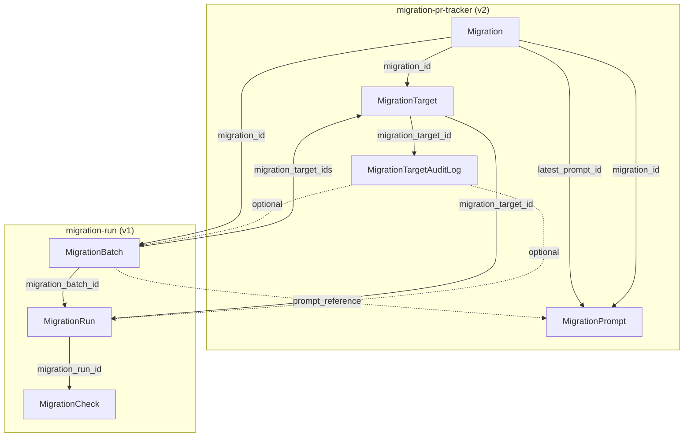

# Migration Backend Architecture — Entities, Fields & Relationships

Source: `wix-vmr-repo/astra` (migration-pr-tracker + migration-run).  
This diagram shows all entities, their fields, and how they connect.

---

## 1. Full entity relationship diagram (Mermaid)

```mermaid
classDiagram
    direction TB

    %% ========== MIGRATION (migration-pr-tracker v2) ==========
    class Migration {
        <<entity wix.astra.migration.v2.migration>>
        +String id (GUID, readOnly)
        +Int64 revision (readOnly)
        +Timestamp created_date
        +Timestamp updated_date
        +String ownership_tag
        +String logical_id
        +String latest_prompt_id
        +String impact
        +String rollout_instructions
        +String readme
        +MigrationMetrics metrics (readOnly)
        +MigrationConfig config
    }

    class MigrationMetrics {
        +int32 total_targets
        +int32 pending_prs
        +int32 reviewed_prs
        +int32 merged_prs
        +int32 ga_releases
        +int32 failed_migrations
    }

    class MigrationConfig {
        +StackTypeEnum stack
        +GitOptions git_options
        +PRStrategyEnum pr_strategy
        +Int32 concurrency
        +Int32 timeout
        +Bool no_index
    }

    class GitOptions {
        +Bool commit
        +Bool push
        +Bool draft
    }

    class StackType {
        <<enum>>
        UNSPECIFIED JVM NODE PYTHON
    }

    class PRStrategy {
        <<enum>>
        UNSPECIFIED PER_DIRECTORY SINGLE
    }

    %% ========== MIGRATION PROMPT (v2) ==========
    class MigrationPrompt {
        <<entity wix.astra.migration.v2.migration_prompt>>
        +String id (GUID, readOnly)
        +Int64 revision (readOnly)
        +Timestamp created_date
        +Timestamp updated_date
        +String logical_name
        +int32 version
        +Map~string,string~ content
        +String description
        +String migration_id
    }

    %% ========== PROMPT REFERENCE (shared) ==========
    class PromptReference {
        +String logical_name
        +Int32 version (optional)
    }

    %% ========== MIGRATION TARGET (v2) ==========
    class MigrationTarget {
        <<entity wix.astra.migration.v2.migration_target>>
        +String id (GUID, readOnly)
        +Int64 revision (readOnly)
        +Timestamp created_date
        +Timestamp updated_date
        +String migration_id
        +MigrationTargetStatus status
        +String repo
        +String path_in_repo
        +String ownership_tag
        +FeatureToggleStatus feature_toggle_status
        +TargetFramework framework
        +String focus
        +string[] file_paths
        +String logical_name
    }

    class MigrationTargetStatus {
        <<enum>>
        NOT_STARTED IN_PROGRESS PR_CREATED
        WAITING_FOR_REVIEW MERGED_WITH_CHANGES MERGED_WITHOUT_CHANGES
        SERVICE_GAED PR_CLOSED_WITHOUT_MERGE ROLLOUT DONE
        QUEUED FAILED NO_CHANGES_NEEDED CHECKS_FAILED
    }

    class FeatureToggle {
        <<enum>>
        NOT_NEEDED NEEDED CREATED
        PARTIALLY_OPEN FULLY_OPEN MERGED
    }

    class TargetFramework {
        <<enum>>
        BOOTSTRAP LOOM LOOM_PRIME SCALA_LIBRARY
        NODE_LIBRARY SERVERLESS NODE SINGLE_RUN_TIME
    }

    %% ========== MIGRATION BATCH (migration_run v1) ==========
    class MigrationBatch {
        <<entity wix.astra.migration.v1.migration_batch>>
        +String id (GUID, readOnly)
        +Int64 revision (readOnly)
        +Timestamp created_date
        +Timestamp updated_date
        +String name
        +String migration_id
        +string[] migration_target_ids
        +PromptReference prompt_reference
        +MigrationBatchConfig config
        +String buildkite_job_number
        +String buildkite_build_number
        +String buildkite_pipeline
        +String triggered_by
    }

    class MigrationBatchConfig {
        +StackTypeEnum stack
        +GitOptions git_options
        +PRStrategyEnum pr_strategy
        +Int32 concurrency
        +Int32 timeout
        +String astra_version
    }

    %% ========== MIGRATION RUN (migration_run v1) ==========
    class MigrationRun {
        <<entity wix.astra.migration.v1.migration_run>>
        +String id (GUID, readOnly)
        +Int64 revision (readOnly)
        +Timestamp created_date
        +Timestamp updated_date
        +String migration_target_id
        +RepositoryInfo repository_info
        +ExecutionEnvironment environment
        +String astra_version
        +String migration_batch_id
        +String build_system_correlation_id
    }

    class RepositoryInfo {
        +String owner
        +String repository
        +String branch
        +PullRequest pull_request
    }

    class PullRequest {
        +String url
        +Int64 number
    }

    class ExecutionEnvironment {
        <<enum>>
        LOCAL REMOTE PR
    }

    %% ========== MIGRATION CHECK (migration_run v1) ==========
    class MigrationCheck {
        <<entity wix.astra.migration.v1.migration_check>>
        +String id (GUID, readOnly)
        +Int64 revision (readOnly)
        +Timestamp created_date
        +Timestamp updated_date
        +String migration_run_id
        +CheckType type
        +CheckStatus status
        +Timestamp start_time
        +Timestamp end_time
        +String details
        +CheckFailure[] check_failures
        +String external_id
    }

    class CheckFailure {
        +String error_message
        +Timestamp failure_time
        +BuildFailureType type
        +String check_name
    }

    class CheckType {
        <<enum>>
        BUILD TEST LINT REVIEW MERGE
    }

    class CheckStatus {
        <<enum>>
        PENDING IN_PROGRESS PASSED FAILED
    }

    class BuildFailureType {
        <<enum>>
        SCALAC OTHER_BAZEL PROTOBUF_SCALA CI_CHECKS
    }

    %% ========== MIGRATION TARGET AUDIT LOG (v2) ==========
    class MigrationTargetAuditLog {
        <<entity wix.astra.migration.v2.migration_target_audit_log>>
        +String id (GUID, readOnly)
        +Int64 revision (readOnly)
        +Timestamp created_date
        +String migration_target_id
        +Timestamp timestamp
        +AuditEventType event_type
        +String performed_by
        +AuditLogAdditionalData additional_data
        +String migration_run_id
        +String migration_batch_id
    }

    class AuditEventType {
        <<enum>>
        TARGET_CREATED TARGET_QUEUED TARGET_DELETED
        MIGRATION_STARTED MIGRATION_FAILED MIGRATION_NOT_NEEDED
        PR_CREATED TARGET_NOT_FOUND CHECKS_FAILED PR_MERGED PR_CLOSED
    }

    %% ========== RELATIONSHIPS ==========
    Migration --* MigrationMetrics : contains
    Migration --* MigrationConfig : contains
    MigrationConfig --* GitOptions : contains
    Migration "1" --> "*" MigrationTarget : migration_id
    Migration "1" --> "*" MigrationPrompt : migration_id
    Migration "1" --> "*" MigrationBatch : migration_id
    Migration --> MigrationPrompt : latest_prompt_id

    MigrationPrompt --> Migration : migration_id

    MigrationTarget --> Migration : migration_id
    MigrationTarget --> MigrationTargetStatus : status
    MigrationTarget --> FeatureToggle : feature_toggle_status
    MigrationTarget --> TargetFramework : framework
    MigrationTarget "1" --> "*" MigrationRun : migration_target_id
    MigrationTarget "1" --> "*" MigrationTargetAuditLog : migration_target_id

    MigrationBatch --> Migration : migration_id
    MigrationBatch --* PromptReference : contains
    MigrationBatch --* MigrationBatchConfig : contains
    MigrationBatch --> MigrationTarget : migration_target_ids[]
    MigrationBatch "1" --> "*" MigrationRun : migration_batch_id

    MigrationBatchConfig --* GitOptions : contains

    PromptReference ..> MigrationPrompt : logical_name + version

    MigrationRun --> MigrationTarget : migration_target_id
    MigrationRun --> MigrationBatch : migration_batch_id (optional)
    MigrationRun --* RepositoryInfo : contains
    RepositoryInfo --* PullRequest : optional
    MigrationRun --> ExecutionEnvironment : environment
    MigrationRun "1" --> "*" MigrationCheck : migration_run_id

    MigrationCheck --> MigrationRun : migration_run_id
    MigrationCheck --> CheckType : type
    MigrationCheck --> CheckStatus : status
    MigrationCheck --* CheckFailure : check_failures
    CheckFailure --> BuildFailureType : type

    MigrationTargetAuditLog --> MigrationTarget : migration_target_id
    MigrationTargetAuditLog --> MigrationRun : migration_run_id (optional)
    MigrationTargetAuditLog --> MigrationBatch : migration_batch_id (optional)
```

---

## 2. How it all connects (summary)

| From | To | Link field | Cardinality |
|------|----|------------|--------------|
| **Migration** | MigrationPrompt | `latest_prompt_id` | 1 → 1 |
| **Migration** | MigrationTarget | `migration_id` | 1 → many |
| **Migration** | MigrationPrompt | `migration_id` | 1 → many |
| **Migration** | MigrationBatch | `migration_id` | 1 → many |
| **MigrationTarget** | Migration | `migration_id` | many → 1 |
| **MigrationTarget** | MigrationRun | (run has `migration_target_id`) | 1 → many |
| **MigrationTarget** | MigrationTargetAuditLog | `migration_target_id` | 1 → many |
| **MigrationBatch** | Migration | `migration_id` | many → 1 |
| **MigrationBatch** | MigrationTarget | `migration_target_ids[]` | many → many |
| **MigrationBatch** | MigrationRun | (run has `migration_batch_id`) | 1 → many |
| **MigrationBatch** | MigrationPrompt | via `prompt_reference` (logical_name + version) | ref |
| **MigrationRun** | MigrationTarget | `migration_target_id` | many → 1 |
| **MigrationRun** | MigrationBatch | `migration_batch_id` (optional) | many → 1 |
| **MigrationRun** | MigrationCheck | `migration_run_id` | 1 → many |
| **MigrationCheck** | MigrationRun | `migration_run_id` | many → 1 |
| **MigrationTargetAuditLog** | MigrationTarget | `migration_target_id` | many → 1 |
| **MigrationTargetAuditLog** | MigrationRun | `migration_run_id` (optional) | many → 1 |
| **MigrationTargetAuditLog** | MigrationBatch | `migration_batch_id` (optional) | many → 1 |

---

## 3. Service boundaries

- **migration-pr-tracker** (astra): Defines and serves **Migration**, **MigrationTarget**, **MigrationPrompt**, **MigrationTargetAuditLog** (v2 protos). Owns migration setup, targets, prompts, and audit.
- **migration-run** (astra): Defines and serves **MigrationBatch**, **MigrationRun**, **MigrationCheck** (v1 protos). Owns batch execution, runs, and checks (build/test/lint/review/merge).

Both use the same `app_def_id` and share references (e.g. batch → migration_id, run → migration_target_id).

---

## 4. Compact connection flowchart (no fields)

---

## 5. Proto file locations (astra)

| Entity | Proto path |
|--------|------------|
| Migration, MigrationMetrics, MigrationConfig | `migration-pr-tracker/proto/wix/astra/migration/v2/migration.proto` |
| MigrationTarget, MigrationTargetStatus, FeatureToggle, TargetFramework, PromptReference | `migration-pr-tracker/proto/wix/astra/migration/v2/migration_target.proto` |
| MigrationPrompt | `migration-pr-tracker/proto/wix/astra/migration/v2/migration_prompt.proto` |
| MigrationTargetAuditLog | `migration-pr-tracker/proto/wix/astra/migration/v2/migration_target_audit_log.proto` |
| MigrationBatch, MigrationBatchConfig, PromptReference | `migration-run/proto/wix/astra/migration_run/v1/migration_batch.proto` |
| MigrationRun, RepositoryInfo, PullRequest, ExecutionEnvironment | `migration-run/proto/wix/astra/migration_run/v1/migration_run.proto` |
| MigrationCheck, CheckFailure, CheckType, CheckStatus, BuildFailureType | `migration-run/proto/wix/astra/migration_run/v1/migration_check.proto` |
